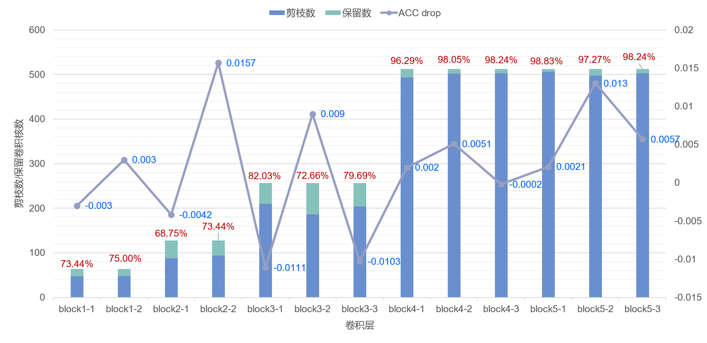

# Pruning CNNs using Reinforcement Learning
Implementation of the paper [Learning to Prune Filters in Convolutional Neural Networks](https://arxiv.org/pdf/1801.07365.pdf)

## requirements

- python  3.8.2               
- tensorboard 2.2.1     
- tensorflow 2.2.0rc3 

## Examples
```
> git clone https://github.com/SharedMemory-F/pruning_cnn_agent
> cd into the directory 
> python main.py
```
VGG16 block1-block5 pruning cnn example:

